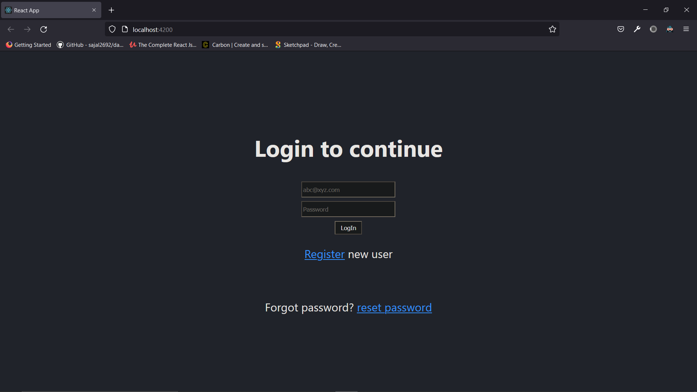
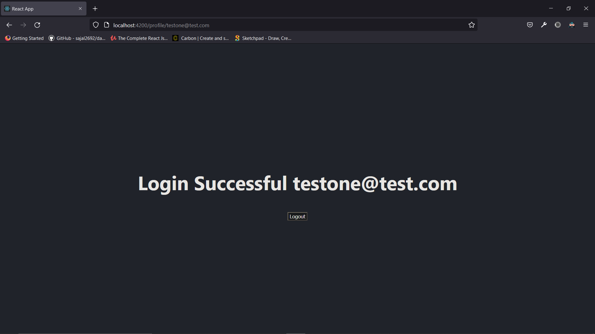
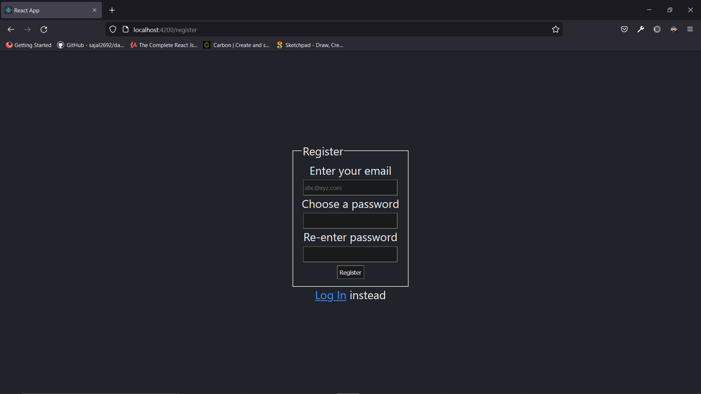
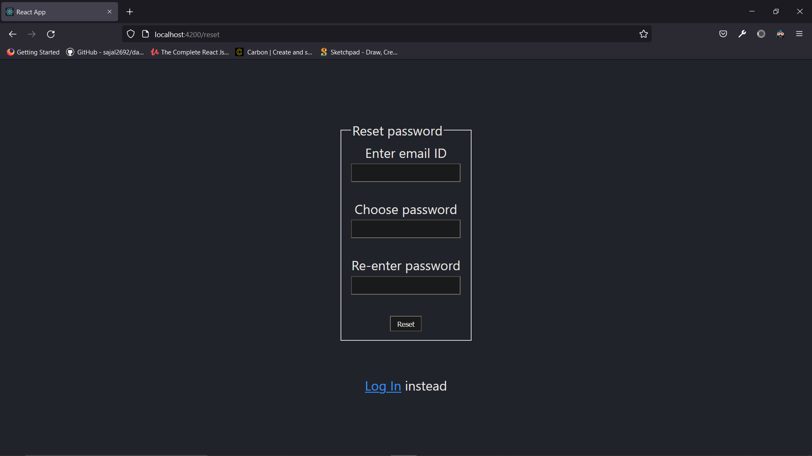

A simple React login mini project with backend implemented using Springboot. 

The Springboot code can be found <a href="https://github.com/AshwinAashu/SpringBoot-Mongo-CRUD">here </a>

The project aimed to create a small reusuable full stack login implementation. The data was stored in a local MongoDB collection. 
Some key highlights here :
  - used axios to implement HTTP requests 
  - CRUD in springboot 
  - Users can log in, reset password, create new accounts.

  
 Screenshots:
  
  
  
  

Things I learnt from this mini project :
- Basics of Spring MVC and Springboot 
- Understanding and using spring initializer 
- Basics of MongoDB 
- Basic Implementation of MVC architecture 
- Connecting Springboot to MongoDB 
- Using Postman to perform basic api testing
- Using Axios to implement HTTP requests from the frontend to the backend
